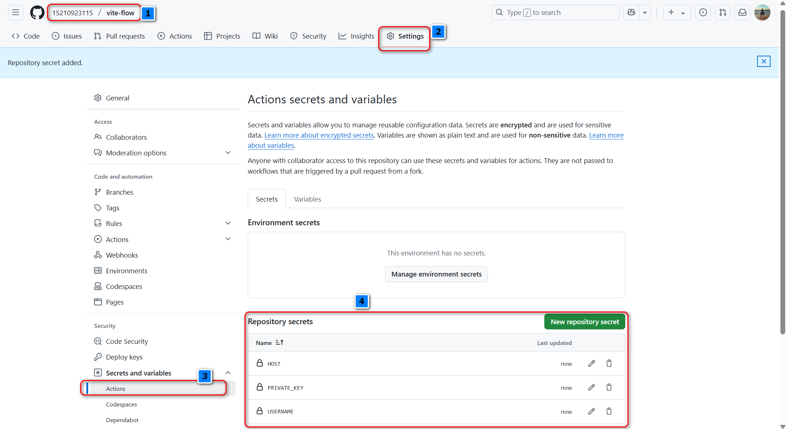
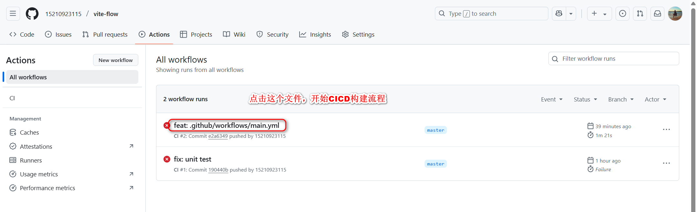
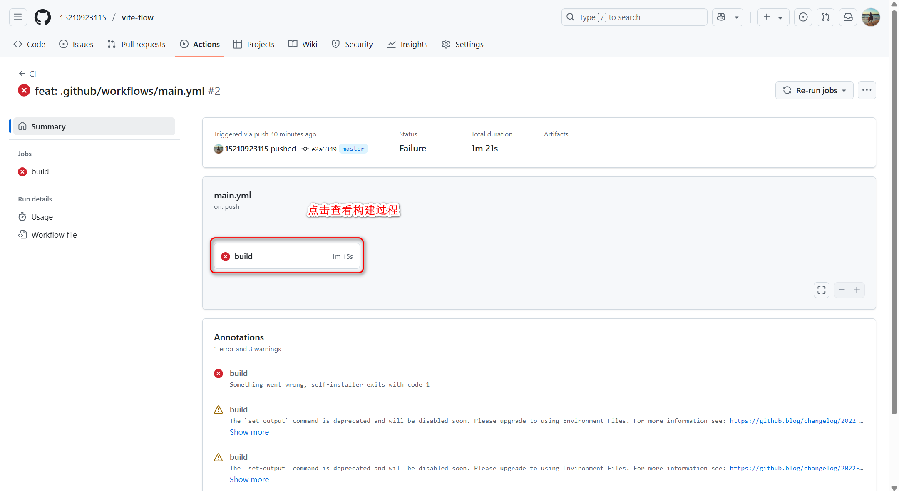
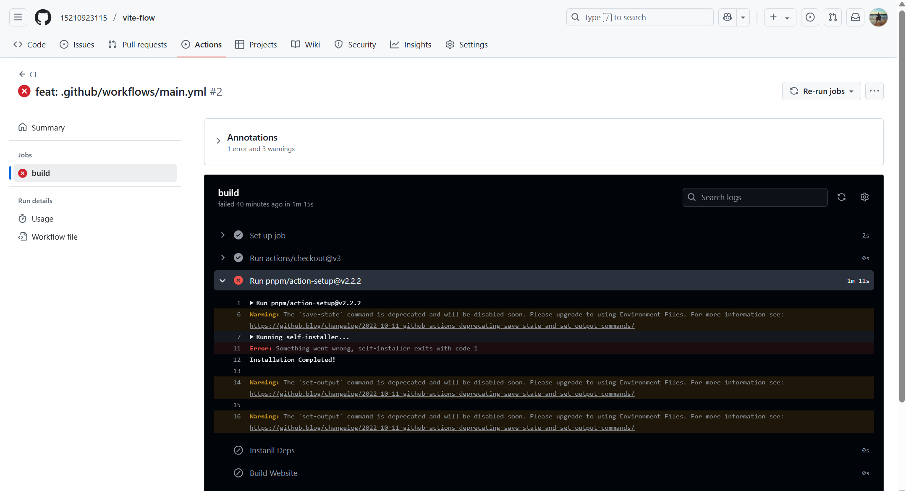

# 一、pnpm 管理项目

- 快：pnpm 是同类工具速度的 2 倍
- 高效：node_modules 中的所有文件均链接自单一存储位置
- 支持单体仓库：monoreop，单个源码仓库中包含多个软件包的支持
- 权限严格：pnpm 创建的 node_modules 默认非扁平结构，因此代码无法对任意软件包进行访问（npm、yarn 存在幽灵依赖问题）

# 二、vite 介绍

- 极速的服务启动，使用原生 ESM 文件，按需加载，无需打包。（原来是整个项目的代码打包在一起，然后才能启动服务）
- 开发时使用的是 EsBuild，它是用 go 语言开发的，轻量快速的热重载，无论应用程序大小如何，都始终极快的默认热替换（HMR）
- 丰富的功能，对 ts、jsx、css 等支持开箱即用
- 优化的构建，可选多页应用或库模式的预配置，使用 rollup 构建
- 通用的插件，在开发和构建之间共享 rollup-superset 插件接口
- 完全类型化的 API、灵活的 API、完整的 ts 支持

> Vite3 修复了 400+issue，减少了体积，Vite 决定每年发布一个新的版本

# 三、项目初始化

### 3.1 项目初始化

```
pnpm init # 初始化package.json
pnpm install vite@3.1.0 -D # 安装vite
pnpm install vue@^3.2.39 # 安装vue
pnpm install @vitejs/plugin-vue@3.1.0 -D # 支持vite解析并编译.vue文件
pnpm install typescript vue-tsc -D # 安装ts和vue-tsc
pnpm dev # 启动开发服务
```

### 3.2 eslint

eslint 默认有三项：

1. 只校验语法。
2. 校验语法，找到哪里出问题了。
3. 校验语法，找到哪里出问题了，并且强制化代码样式（强制代码风格）。

通常，我们只使用第 2 种选项，eslint 只做规范检测，不涉及强制代码风格，代码风格的事情交给 prettier 去做。

```
npx eslint --init
```

> 需要在 vscode 中安装 `eslint`插件。

### 3.3 prettier

.prettierrc.js

```
module.exports = {
  singleQuote: false, // 使用双引号
  semi: false, // 末尾不添加分号
  tabWidth: 2, // tab * 2
  trailingComma: "none", // 对象最后一个属性后面有没有,
  useTabs: false, // 是否使用tab
  endOfLine: "auto" // 换行符
}

```

.prettierignore

```
node_modules
dist
```

> 需要在 vscode 中安装 `prettier`插件：prettier 只是用来格式化代码；
>
> 这里需要配置 `Format On Save`为启用，保存时自动格式化；
>
> Default Formatter 选择 `Prettier - Code formatter`；

### 3.4 editorconfig

.editorconfig

```
root = true

[*]
charset = utf-8
indent_style = space
indent_size = 2
end_of_line = lf
```

> 需要安装 vscode 中的 `EditorConfig for VS Code`插件。

### 3.5 husk（git hook）

需要先安装 husky 包，它可以帮我们生成 git hook

```
pnpm i husky -D
```

然后在 package.json 中：

```
{
	"scripts": {
		"prepare": "husky install"
	}
}
```

执行 `pnpm i`的时候，默认会先执行 prepare 命令。

在这里，我们需要手动执行一遍 pnpm prepare，因为依赖先前都已经安装完了：

```
$ pnpm prepare

> vite-flow@1.0.0 prepare G:\zfdemo\vue3-gongchenghua\vite-flow
> husky install

husky - Git hooks installed

```

以上命令会在项目根目录下生成：

```
.husky/_
  .gitignore
  husky.sh
```

然后执行：

```
git init
npx husky add .husky/pre-commit "pnpm lint"
```

以上命令的意思是在.husky 文件夹中添加 pre-commit 文件，并在其中添加 pnpm lint 命令，表示在 git commit 之前执行 pnpm lint 命令，做代码校验。

在 src/main.ts 中书写如下代码：

```
import { createApp } from "vue"
import App from "./App.vue"

createApp(App).mount("#app")

const a = 1

if (true) {
}

```

执行如下命令提交代码：

```
$ git commit -m 'ok'

> vite-flow@1.0.0 lint G:\zfdemo\vue3-gongchenghua\vite-flow
> eslint --fix --ext .ts,.tsx,.vue src --quiet


G:\zfdemo\vue3-gongchenghua\vite-flow\src\main.ts
  8:5   error  Unexpected constant condition  no-constant-condition
  8:11  error  Empty block statement          no-empty

✖ 2 problems (2 errors, 0 warnings)

 ELIFECYCLE  Command failed with exit code 1.
husky - pre-commit hook exited with code 1 (error)

```

发现 husky 触发了 pre-commit 钩子中的 pnpm lint 命令，修改代码完不规范的代码后，就可以正常提交代码了。

### 3.6 commitlint 提交时的 git 检测规范

类型

1. build：主要目的是修改项目构建系统，如 gulp、webpack、rollup 的配置等的提交。
2. chore：不属于以上类型时的其它类型。
3. ci：主要目的是修改项目集成流程，如 Travis、Jenkins、GitLab CI、Cifcle 等的提交。
4. docs：文档更新。
5. feat：新功能、新特性。
6. fix：修改 bug。
7. peft：更改代码，以提高性能。
8. refactor：代码重构（重构，在不影响代码内部行为、功能下的代码修改）。
9. revert： 恢复上一次提交。
10. style：不影响程序逻辑的代码修改（修改空白字符、格式缩进、不全缺失的分号等，没有改变代码逻辑）。
11. test：测试用例新增、修改。

> 代码提交检测

```
pnpm install @commitlint/cli @commitlint/config-conventional -D
npx husky add .husky/commit-msg "npx --no-install commitlint --edit $1"
```

> commitlint.config.js 配置

```
module.exports = {
	extends: ["@commitlint/config-conventional"]
}
```

> git commit -m "feat: 初始化工程"

# 四、路由

> 小项目，可以采用约定式路由，根据规范来创建目录。
>
> 大项目，菜单比较多，建议采用配置式路由，直接从后台去配置菜单，维护起来更方便。

### 4.1 自动引入插件

```
pnpm install -D unplugin-auto-import
```

安装完该插件后，在 vite.config.ts 中配置如下：

```
import { defineConfig } from "vite"
import vue from "@vitejs/plugin-vue"
import AutoImport from "unplugin-auto-import/vite"

// vite 默认只会编译ts 不会检测ts
export default defineConfig({
  plugins: [
    vue(),
    AutoImport({
      imports: ["vue", "vue-router"]
    })
  ]
})

```

会自动在项目的根目录下创建一个 auto-import.d.ts 文件，帮我们自动引入一些类型声明：

```
// Generated by 'unplugin-auto-import'
export {}
declare global {
  const EffectScope: typeof import("vue")["EffectScope"]
  const computed: typeof import("vue")["computed"]
  const createApp: typeof import("vue")["createApp"]
  const customRef: typeof import("vue")["customRef"]
  const defineAsyncComponent: typeof import("vue")["defineAsyncComponent"]
  const defineComponent: typeof import("vue")["defineComponent"]
  const effectScope: typeof import("vue")["effectScope"]
  const getCurrentInstance: typeof import("vue")["getCurrentInstance"]
  const getCurrentScope: typeof import("vue")["getCurrentScope"]
  const h: typeof import("vue")["h"]
  const inject: typeof import("vue")["inject"]
  const isProxy: typeof import("vue")["isProxy"]
  const isReactive: typeof import("vue")["isReactive"]
  const isReadonly: typeof import("vue")["isReadonly"]
  const isRef: typeof import("vue")["isRef"]
  const markRaw: typeof import("vue")["markRaw"]
  const nextTick: typeof import("vue")["nextTick"]
  const onActivated: typeof import("vue")["onActivated"]
  const onBeforeMount: typeof import("vue")["onBeforeMount"]
  const onBeforeUnmount: typeof import("vue")["onBeforeUnmount"]
  const onBeforeUpdate: typeof import("vue")["onBeforeUpdate"]
  const onDeactivated: typeof import("vue")["onDeactivated"]
  const onErrorCaptured: typeof import("vue")["onErrorCaptured"]
  const onMounted: typeof import("vue")["onMounted"]
  const onRenderTracked: typeof import("vue")["onRenderTracked"]
  const onRenderTriggered: typeof import("vue")["onRenderTriggered"]
  const onScopeDispose: typeof import("vue")["onScopeDispose"]
  const onServerPrefetch: typeof import("vue")["onServerPrefetch"]
  const onUnmounted: typeof import("vue")["onUnmounted"]
  const onUpdated: typeof import("vue")["onUpdated"]
  const provide: typeof import("vue")["provide"]
  const reactive: typeof import("vue")["reactive"]
  const readonly: typeof import("vue")["readonly"]
  const ref: typeof import("vue")["ref"]
  const resolveComponent: typeof import("vue")["resolveComponent"]
  const shallowReactive: typeof import("vue")["shallowReactive"]
  const shallowReadonly: typeof import("vue")["shallowReadonly"]
  const shallowRef: typeof import("vue")["shallowRef"]
  const toRaw: typeof import("vue")["toRaw"]
  const toRef: typeof import("vue")["toRef"]
  const toRefs: typeof import("vue")["toRefs"]
  const triggerRef: typeof import("vue")["triggerRef"]
  const unref: typeof import("vue")["unref"]
  const useAttrs: typeof import("vue")["useAttrs"]
  const useCssModule: typeof import("vue")["useCssModule"]
  const useCssVars: typeof import("vue")["useCssVars"]
  const useRoute: typeof import("vue-router")["useRoute"]
  const useRouter: typeof import("vue-router")["useRouter"]
  const useSlots: typeof import("vue")["useSlots"]
  const watch: typeof import("vue")["watch"]
  const watchEffect: typeof import("vue")["watchEffect"]
  const watchPostEffect: typeof import("vue")["watchPostEffect"]
  const watchSyncEffect: typeof import("vue")["watchSyncEffect"]
}

```

### 4.2 安装如下插件，解析 vue 中的 tsx 语法

```
pnpm install @vitejs/plugin-vue-jsx@2.0.1 -D
```

在 vite.config.ts 中引入 tsx 的支持：

```
import { defineConfig } from "vite"
import vue from "@vitejs/plugin-vue"
import AutoImport from "unplugin-auto-import/vite"
import jsx from "@vitejs/plugin-vue-jsx" // 支持vue中的tsx语法
import path from "path"

// vite 默认只会编译ts 不会检测ts
export default defineConfig({
  plugins: [
    vue(),
    jsx(),
    AutoImport({
      imports: ["vue", "vue-router"],
      eslintrc: {
        // 配置上该属性，会自动生成.eslintrc-auto-import.json文件，然后在.eslintrc.js中的extends扩展中引入该文件里的规则
        // 以便于让eslint识别里面的规则
        enabled: true
      }
    })
  ],
  resolve: {
    // 配置路径别名
    alias: [
      {
        find: "@",
        replacement: path.resolve(__dirname, "src")
      }
    ]
  }
})

```

# 五、Unocss

> 传统的 css 预处理器：scss、less、stylus

Atomic css 原子 css 是一种 CSS 架构方法，把每一个样式都作为一个独立的原子去使用。传统方法使用预处理器编译后生成样式，但是体积大。（类似行内样式，但是行内样式缺点：冗余）

- Tailwind 依赖 PostCSS 和 Autoprefixer + purgeCSS，开发环境 css 体积大
- Windi CSS 是一种 Tailwind CSS 替代品，不依赖，按需使用。采用预扫描的方式生成样式。但是自定义很复杂~
- unocss 是原子 CSS 引擎，规则定义简单易读，支持预设、属性、纯 css 图标。

```
pnpm install unocss -D
```

配置如下：

```
import { defineConfig } from "vite"
import vue from "@vitejs/plugin-vue"
import AutoImport from "unplugin-auto-import/vite"
import jsx from "@vitejs/plugin-vue-jsx" // 支持vue中的tsx语法
import path from "path"

import Unocss from "unocss/vite"
import { presetUno, presetAttributify, presetIcons } from "unocss"

// vite 默认只会编译ts 不会检测ts
export default defineConfig({
  plugins: [
    vue(),
    jsx(),
    Unocss({
      /* options */
      presets: [
        // presetUno 默认预设 支持windicss
        presetUno(),
        // 支持将类名用属性的方式表示
        presetAttributify(),
        // 支持css icon
        presetIcons()
      ]
    }),
    AutoImport({
      imports: ["vue", "vue-router"],
      eslintrc: {
        // 配置上该属性，会自动生成.eslintrc-auto-import.json文件，然后在.eslintrc.js中的extends扩展中引入该文件里的规则
        // 以便于让eslint识别里面的规则
        enabled: true
      }
    })
  ],
  resolve: {
    // 配置路径别名
    alias: [
      {
        find: "@",
        replacement: path.resolve(__dirname, "src")
      }
    ]
  }
})

```

属性的写法如下：

```
<h1 text-center>Todo List</h1>
```

# 六、ICON

安装 css icon 样式包：

```
@iconify-json/ep
```

使用方式：

```
import "@iconify-json/ep"
```

```
<div class="i-ep-edit"></div>
```

# 七、vitest 单元测试

Vite 有自己的单元测试框架：

```
pnpm install vitest -D
```

测试 Vue 项目的时候，常配合[Vue Test Utils](https://test-utils.vuejs.org/zh/ "官网")工具一起使用：

```
pnpm i @vue/test-utils -D
pnpm i happy-dom -D
pnpm i @types/jest -D
```

在 vite.config.ts 中添加配置：

```
/// <reference types="vitest" />

import { defineConfig } from "vite"
import vue from "@vitejs/plugin-vue"
import AutoImport from "unplugin-auto-import/vite"
import jsx from "@vitejs/plugin-vue-jsx" // 支持vue中的tsx语法
import path from "path"

import Unocss from "unocss/vite"
import { presetUno, presetAttributify, presetIcons } from "unocss"

// vite 默认只会编译ts 不会检测ts
export default defineConfig({
  plugins: [
    vue(),
    jsx(),
    Unocss({
      /* options */
      presets: [
        // presetUno 默认预设 支持windicss
        presetUno(),
        // 支持将类名用属性的方式表示
        presetAttributify(),
        // 支持css icon
        presetIcons({
          // 自定义icon的css属性
          extraProperties: {
            display: "inline-flex",
            width: "2em",
            height: "2em",
            "vertical-align": "middle"
          },
          collections: {
            zf: {
              circle: `<svg xmlns="http://www.w3.org/2000/svg" width="32" height="32" viewBox="0 0 1024 1024"><!-- Icon from Element Plus by Element Plus - https://github.com/element-plus/element-plus-icons/blob/main/packages/svg/package.json --><path fill="currentColor" d="M736 800V160H160v640a64 64 0 0 0 64 64h448a64 64 0 0 0 64-64m64-544h63.552a96 96 0 0 1 96 96v224a96 96 0 0 1-96 96H800v128a128 128 0 0 1-128 128H224A128 128 0 0 1 96 800V128a32 32 0 0 1 32-32h640a32 32 0 0 1 32 32zm0 64v288h63.552a32 32 0 0 0 32-32V352a32 32 0 0 0-32-32z"/></svg>`
            }
          }
        })
      ]
    }),
    AutoImport({
      imports: ["vue", "vue-router"],
      eslintrc: {
        // 配置上该属性，会自动生成.eslintrc-auto-import.json文件，然后在.eslintrc.js中的extends扩展中引入该文件里的规则
        // 以便于让eslint识别里面的规则
        enabled: true
      }
    })
  ],
  resolve: {
    // 配置路径别名
    alias: [
      {
        find: "@",
        replacement: path.resolve(__dirname, "src")
      }
    ]
  },
  // 要在这里书写test，必须在文件的头部引入vitest的类型声明文件，防止vite不识别test属性
  test: {
    globals: true,
    environment: "happy-dom",
    transformMode: { web: [/.tsx$/] }
  }
})

```

借用 husky 添加一个钩子：

```
 npx husky add .husky/pre-push "pnpm test:run"
```

表示每次 push 代码前，都执行一次单元测试，测试通过了才允许提交代码。

# 八、Mock 数据

```
pnpm i mockjs@1.1.0 vite-plugin-mock@2.9.6 -D
```

# 九、配置开发服务代理

```
server: {
    // 方向代理  不需要配置跨域  http://127.0.0.1:3000/login
    proxy: {
      // http-proxy 在中间做了个中间层  客户端->(中间层*透明的* -> 真实服务器)
      "/api": {
        target: "http://localhost:3000/",
        changeOrigin: true, // 这里不加服务端无法拿到origin属性
        rewrite: (path) => path.replace(/^\/api/, "")
      }
    }
  }
```

# 十、Pinia 状态管理

# 十一、CIDI 自动发布

需要在工程的根目录下创建 `.github/workflows/main.yml`文件（这是约定，固定死的文件），文件内容如下：

```
# This is a basic workflow to help you get started with Actions

name: CI

# Controls when the workflow will run
on:
  # Triggers the workflow on push or pull request events but only for the "master" branch
  push:
    branches: ["master"]

  # Allows you to run this workflow manually from the Actions tab
  workflow_dispatch:

# A workflow run is made up of one or more jobs that can run sequentially or in parallel
jobs:
  # This workflow contains a single job called "build"
  build:
    # The type of runner that the job will run on
    runs-on: ubuntu-latest

    # Steps represent a sequence of tasks that will be executed as part of the job
    steps:
      # Checks-out your repository under $GITHUB_WORKSPACE, so your job can access it
      - uses: actions/checkout@v3
      - uses: pnpm/action-setup@v2.2.2
        with:
          # Version of pnpm to install
          version: "7.5.0"

      - name: Instanll Deps
        run: pnpm install

      - name: Build Website
        run: pnpm build

      - name: ssh deploy
        uses: easingthemes/ssh-deploy@v2.2.11
        with:
          # Private Key
          SSH_PRIVATE_KEY: ${{ secrets.PRIVATE_KEY }}
          # Remote host
          REMOTE_HOST: ${{ secrets.HOST }}
          # Remote user
          REMOTE_USER: ${{ secrets.USERNAME }}
          # Remote port
          SOURCE: ./dist/
          # Target directory
          TARGET: /home/test

```

可以看到，执行CICD的脚本中，检测的是 `master`分支一旦有新的推送，就立即出发构建任务，服务器使用的是 `ubuntu-latest `系统，然后先安装7.5.0版本的 `pnpm `，再执行 `pnpm install `命令安装依赖，然后执行 `pnpm build`命令打包，打包后的操作通常有以下几种：

1. 上传到OSS上
2. 上传到CDN上
3. 放到自己的服务器上

在这里，打包后，我们是上传到自己的服务器上了，上传服务器有以下两种方式：

1. 自己手动上传
2. 通过scp命令
3. 通过ssh命令

这里，我们使用ssh的方式上传打包后的文件到服务器上。

服务器的秘钥肯定不能写死在文件里，都是可以在github中配置的，如下所示：



Repository serects中的秘钥可以在main.yml文件中直接通过 `${{ secrets.xxx }}`访问。`PRIVATE_KEY`是目标服务器上的私钥，一般是 `~/.ssh/id_rsa`文件。






